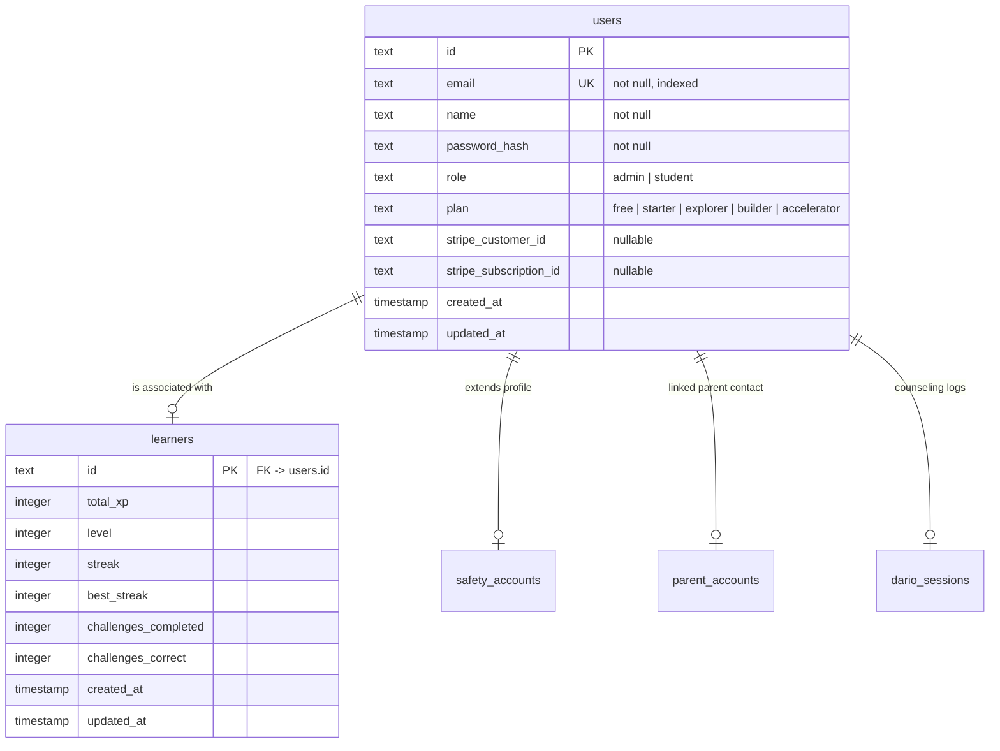

# 🛡️ Production Security, Database, Authentication & Monorepo Implementation Plan

This document serves as a comprehensive, professional engineering guide to elevate the **1WayMirror World** codebase from an AI-generated prototype to a secure, robust, and highly scalable production-ready system. 

It provides an in-depth analysis of existing security vulnerabilities, details the database schema updates, defines the architecture for a server-side HttpOnly cookie session/JWT authentication flow, designs the Stripe billing system, and outlines monorepo developer collaboration standards.

---

## 1. Vulnerability & Security Risk Assessment

Below is a detailed breakdown of the critical vulnerabilities present in the current prototype and their architectural impacts.

### 🔴 Critical: Client-Side Authentication Bypass
* **How it works now**: Password verification occurs client-side in `mech-vr-lab/src/lib/auth.ts`. The frontend hashes a user’s password with SHA-256 (no salt secrecy) and compares it with local listings in browser `localStorage` (`1waymirror_accounts_v1`). Active sessions are saved in `localStorage` under `1waymirror_auth_v1`.
* **The Risk**: Any user can open the browser developer tools, write a single line of JavaScript (e.g., `localStorage.setItem('1waymirror_auth_v1', JSON.stringify({ name: 'Admin', email: 'one.waymirror@outlook.com' }))`), and instantly masquerade as any student or administrator.
* **Production Fix**: Shift authentication entirely to the backend. The frontend will only store transient UI state; the API server will act as the single gatekeeper using server-signed JWTs delivered via HttpOnly cookies.

### 🔴 Critical: LocalStorage Subscription Gates
* **How it works now**: Subscription plans are saved client-side under the `1waymirror_plan_v1` key. Feature gating checks `hasPlanFeature(plan, 'dario-chat')` purely in React.
* **The Risk**: A user can gain access to premium features (like Dario AI Counselor chat, roadmaps, and custom reports which incur real token costs on OpenAI) by manually setting `localStorage.setItem('1waymirror_plan_v1', 'accelerator')`.
* **Production Fix**: Subscriptions must be stored in the PostgreSQL database. When a user requests a premium feature (e.g., `POST /api/dario/chat`), the backend must query the user's current plan in the database and reject unauthorized requests before running business logic or invoking OpenAI.

### ⚠️ High: Weak & Unsalted Password Hashing
* **How it works now**: The client uses SHA-256 for password hashing.
* **The Risk**: SHA-256 is extremely fast and vulnerable to hardware-accelerated GPU brute-force/dictionary attacks. If a malicious actor retrieves a copy of client database logs or localStorage values, they can reverse passwords in minutes. Moreover, lack of unique server-generated salts makes user credentials vulnerable to rainbow table attacks.
* **Production Fix**: Hash passwords on the server using **bcryptjs** (with a work factor of 12) or **argon2id**.

### ⚠️ High: Hardcoded Credentials & Static Secrets
* **How it works now**: The admin UI login (`one.waymirror@outlook.com` / `Shipnot2020!`) is hardcoded directly inside `AdminPage.tsx`. The API server's default admin PIN (`1WAY2026`) is checked inline.
* **The Risk**: Anyone inspecting the React bundles can search for the email and extract the password.
* **Production Fix**: Remove all hardcoded credentials. Maintain admins in the PostgreSQL database as users with the `role = 'admin'`. Store secrets (JWT secrets, API keys, database credentials) strictly in environment variables validated at server startup using **Zod**.

### ⚠️ High: Dynamic CORS Open to Everyone
* **How it works now**: The backend uses `app.use(cors())` without parameters, permitting any web domain to send cross-origin requests to the API.
* **The Risk**: This opens the application to Cross-Origin Resource Sharing (CORS) exploits and makes it difficult to securely pass credentials (like HttpOnly session cookies) between the React client and Express server.
* **Production Fix**: Restrict CORS origins using a dynamic environment configuration, and explicitly set `credentials: true` to enable secure cookie sharing.

---

## 2. Database Schema Updates & Migrations

To transition away from local storage mockups, we will define a unified, relational database structure.



### 1. New Schema File: `lib/db/src/schema/users.ts`
Create `lib/db/src/schema/users.ts` to manage credentials, roles, and billing:

```typescript
import { pgTable, text, timestamp } from "drizzle-orm/pg-core";

export const usersTable = pgTable("users", {
  id: text("id").primaryKey(), // UUID generated on the backend
  email: text("email").notNull().unique(),
  name: text("name").notNull(),
  passwordHash: text("password_hash").notNull(),
  role: text("role").notNull().default("student"), // "student" | "admin"
  plan: text("plan").notNull().default("free"), // "free" | "starter" | "explorer" | "builder" | "accelerator"
  stripeCustomerId: text("stripe_customer_id"),
  stripeSubscriptionId: text("stripe_subscription_id"),
  createdAt: timestamp("created_at", { withTimezone: true }).defaultNow().notNull(),
  updatedAt: timestamp("updated_at", { withTimezone: true }).defaultNow().notNull(),
});

export type User = typeof usersTable.$inferSelect;
export type InsertUser = typeof usersTable.$inferInsert;
```

Export this table in `lib/db/src/schema/index.ts`:
```typescript
export * from "./users";
// ... other exports
```

### 2. Linking Tables
Update `lib/db/src/schema/learners.ts` and `safety_accounts` to relate to the central `users` table via foreign keys or shared identifiers. 

For `learnersTable`, the `id` field should match the `id` from the `usersTable`. When a user registers:
1. Insert the primary user credentials into `usersTable`.
2. Insert a blank learner stats sheet into `learnersTable` matching that user ID.
3. Insert any initial safety constraints into `safetyAccountsTable`.

### 3. Running Database Migrations
We will generate migrations using Drizzle Kit:
```powershell
# From the workspace root
pnpm --filter @workspace/db run generate
pnpm --filter @workspace/db run migrate
```

---

## 3. Backend-First Authentication System

A secure authentication architecture uses backend-generated JSON Web Tokens (JWT) stored in a secure cookie container.

### Step 1: Install Dependencies
Add key modules in the backend server (`artifacts/api-server/package.json`):
```json
"dependencies": {
  "bcryptjs": "^2.4.3",
  "jsonwebtoken": "^9.0.2",
  "cookie-parser": "^1.4.7"
}
```
Add types to `devDependencies` (`@types/bcryptjs`, `@types/jsonwebtoken`).

### Step 2: Create Auth Router (`artifacts/api-server/src/routes/auth.ts`)
This router contains endpoints for signup, sign-in, sign-out, and active session fetching.

```typescript
import { Router } from "express";
import { db, usersTable, learnersTable, safetyAccountsTable, trustScoresTable } from "@workspace/db";
import { eq } from "drizzle-orm";
import bcrypt from "bcryptjs";
import jwt from "jsonwebtoken";
import crypto from "crypto";

const router = Router();
const JWT_SECRET = process.env.JWT_SECRET || "fallback-super-secret-key-32-chars";

function setAuthCookie(res: any, userId: string) {
  const token = jwt.sign({ sub: userId }, JWT_SECRET, { expiresIn: "7d" });

  res.cookie("auth_token", token, {
    httpOnly: true, // Blocks client JavaScript access (mitigates XSS)
    secure: process.env.NODE_ENV === "production", // Sent only over HTTPS
    sameSite: "lax", // Protects against CSRF
    maxAge: 7 * 24 * 60 * 60 * 1000, // 7 days
  });
}

// POST /api/auth/register
router.post("/register", async (req, res): Promise<void> => {
  const { name, email, password } = req.body;

  if (!name || !email || !password) {
    res.status(400).json({ error: "Name, email, and password are required" });
    return;
  }

  const normEmail = email.toLowerCase().trim();

  try {
    const existing = await db.select().from(usersTable).where(eq(usersTable.email, normEmail)).limit(1);
    if (existing[0]) {
      res.status(400).json({ error: "Email already registered" });
      return;
    }

    const passwordHash = await bcrypt.hash(password, 12);
    const userId = crypto.randomUUID();

    // Transaction to guarantee atomicity across tables
    await db.transaction(async (tx) => {
      // 1. Create Core User
      await tx.insert(usersTable).values({
        id: userId,
        email: normEmail,
        name: name.trim(),
        passwordHash,
        role: "student",
        plan: "free",
      });

      // 2. Initialize Learner Stats
      await tx.insert(learnersTable).values({
        id: userId,
        totalXp: 0,
        level: 1,
        streak: 0,
        bestStreak: 0,
      });
    });

    setAuthCookie(res, userId);

    res.status(201).json({
      id: userId,
      name: name.trim(),
      email: normEmail,
      role: "student",
      plan: "free",
    });
  } catch (err) {
    res.status(500).json({ error: "Registration failed. Try again later." });
  }
});

// POST /api/auth/login
router.post("/login", async (req, res): Promise<void> => {
  const { email, password } = req.body;

  if (!email || !password) {
    res.status(400).json({ error: "Missing email or password" });
    return;
  }

  const normEmail = email.toLowerCase().trim();

  try {
    const users = await db.select().from(usersTable).where(eq(usersTable.email, normEmail)).limit(1);
    if (!users[0]) {
      res.status(401).json({ error: "Invalid email or password" });
      return;
    }

    const isValid = await bcrypt.compare(password, users[0].passwordHash);
    if (!isValid) {
      res.status(401).json({ error: "Invalid email or password" });
      return;
    }

    setAuthCookie(res, users[0].id);

    res.json({
      id: users[0].id,
      name: users[0].name,
      email: users[0].email,
      role: users[0].role,
      plan: users[0].plan,
    });
  } catch (err) {
    res.status(500).json({ error: "Login failed" });
  }
});

// GET /api/auth/me
router.get("/me", async (req, res): Promise<void> => {
  const token = req.cookies?.auth_token;
  if (!token) {
    res.status(401).json({ error: "Not logged in" });
    return;
  }

  try {
    const payload = jwt.verify(token, JWT_SECRET) as { sub: string };
    const users = await db.select().from(usersTable).where(eq(usersTable.id, payload.sub)).limit(1);

    if (!users[0]) {
      res.status(401).json({ error: "User session not found" });
      return;
    }

    res.json({
      id: users[0].id,
      name: users[0].name,
      email: users[0].email,
      role: users[0].role,
      plan: users[0].plan,
    });
  } catch (err) {
    res.clearCookie("auth_token");
    res.status(401).json({ error: "Session expired" });
  }
});

// POST /api/auth/logout
router.post("/logout", (req, res) => {
  res.clearCookie("auth_token", {
    httpOnly: true,
    secure: process.env.NODE_ENV === "production",
    sameSite: "lax",
  });
  res.json({ ok: true });
});

export default router;
```

### Step 3: Implement Auth & Guarding Middlewares
Create `artifacts/api-server/src/middlewares/auth.ts` to manage server-side security checks:

```typescript
import { Request, Response, NextFunction } from "express";
import jwt from "jsonwebtoken";
import { db, usersTable } from "@workspace/db";
import { eq } from "drizzle-orm";

const JWT_SECRET = process.env.JWT_SECRET || "fallback-super-secret-key-32-chars";

declare global {
  namespace Express {
    interface Request {
      user?: {
        id: string;
        email: string;
        name: string;
        role: "student" | "admin";
        plan: "free" | "starter" | "explorer" | "builder" | "accelerator";
      };
    }
  }
}

// 1. authenticate: Parses session cookies and populates req.user
export async function authenticate(req: Request, res: Response, next: NextFunction) {
  const token = req.cookies?.auth_token;
  if (!token) return next();

  try {
    const payload = jwt.verify(token, JWT_SECRET) as { sub: string };
    const users = await db.select().from(usersTable).where(eq(usersTable.id, payload.sub)).limit(1);

    if (users[0]) {
      req.user = {
        id: users[0].id,
        email: users[0].email,
        name: users[0].name,
        role: users[0].role as "student" | "admin",
        plan: users[0].plan as any,
      };
    }
  } catch (err) {
    res.clearCookie("auth_token");
  }
  next();
}

// 2. requireAuth: Gates access to authenticated users
export function requireAuth(req: Request, res: Response, next: NextFunction) {
  if (!req.user) {
    res.status(401).json({ error: "Unauthorized. Please sign in." });
    return;
  }
  next();
}

// 3. requireRole: Restricts endpoints to selected roles
export function requireRole(allowedRoles: ("student" | "admin")[]) {
  return (req: Request, res: Response, next: NextFunction) => {
    if (!req.user || !allowedRoles.includes(req.user.role)) {
      res.status(403).json({ error: "Forbidden: Access denied" });
      return;
    }
    next();
  };
}

// 4. requirePlan: Enforces plan gating
export function requirePlan(minimumPlan: "free" | "starter" | "explorer" | "builder" | "accelerator") {
  const weights = { free: 0, starter: 1, explorer: 2, builder: 3, accelerator: 4 };

  return (req: Request, res: Response, next: NextFunction) => {
    if (!req.user) {
      res.status(401).json({ error: "Unauthorized" });
      return;
    }

    const userWeight = weights[req.user.plan] ?? 0;
    const minWeight = weights[minimumPlan];

    if (userWeight < minWeight) {
      res.status(403).json({
        error: `Upgrade Required: This feature requires a ${minimumPlan} plan or higher.`,
      });
      return;
    }
    next();
  };
}
```

### Step 4: Mount Modules in `app.ts`
Modify `artifacts/api-server/src/app.ts`:
```typescript
import cookieParser from "cookie-parser";
import authRouter from "./routes/auth.js";
import { authenticate } from "./middlewares/auth.js";

// ...
app.use(cookieParser());
app.use(authenticate); // Attach session identities globally

app.use("/api/auth", authRouter);
```

---

## 4. Frontend Authentication & State Integration

With credentials managed on the backend, update `mech-vr-lab/src/lib/auth.ts` to coordinate with backend routes.

```typescript
// artifacts/mech-vr-lab/src/lib/auth.ts
export type AuthUser = {
  id: string;
  name: string;
  email: string;
  role: "student" | "admin";
  plan: "free" | "starter" | "explorer" | "builder" | "accelerator";
};

// We will use React Query to manage signups/logins, querying /api/auth/me to retrieve session state.
```

When integrating the frontend calls, set the `credentials` property in fetch requests (or Axios/React Query client parameters) to `include` (e.g., `credentials: 'same-origin'` or `'include'`). This allows the browser to include security cookies in request headers.

---

## 5. Stripe Subscription & Billing Flow

Instead of storing user subscription plans in local state, we will manage the checkout process and synchronize subscription status with Stripe.

### Checkout Flow Diagram
```
[React Client] ────(Click Subscribe)───► [Backend API] ──(Create Stripe Session)──► [Stripe Checkout]
      ▲                                                                                 │
      │                                                                                 │
(Sync Plan)                                                                         (Redirects)
      │                                                                                 ▼
[Postgres DB] ◄───(Update users.plan)─── [Webhook Endpoint] ◄──(Subscription Created)── [Stripe Engine]
```

### Step 1: Install Stripe Backend Library
```powershell
pnpm --filter @workspace/api-server add stripe
```

### Step 2: Define Stripe Router (`artifacts/api-server/src/routes/billing.ts`)
```typescript
import { Router } from "express";
import { requireAuth } from "../middlewares/auth";
import { db, usersTable } from "@workspace/db";
import { eq } from "drizzle-orm";
import Stripe from "stripe";

const stripe = new Stripe(process.env.STRIPE_SECRET_KEY!, { apiVersion: "2023-10-16" as any });
const router = Router();

const PLAN_PRICE_IDS = {
  starter: "price_starter_id",
  explorer: "price_explorer_id",
  builder: "price_builder_id",
  accelerator: "price_accelerator_id",
};

// POST /api/billing/checkout-session
router.post("/checkout-session", requireAuth, async (req, res): Promise<void> => {
  const { plan } = req.body;
  if (!plan || !PLAN_PRICE_IDS[plan]) {
    res.status(400).json({ error: "Invalid plan selection" });
    return;
  }

  const userId = req.user!.id;
  const userEmail = req.user!.email;

  try {
    // 1. Get or create Stripe Customer
    let user = (await db.select().from(usersTable).where(eq(usersTable.id, userId)).limit(1))[0];
    let stripeCustomerId = user.stripeCustomerId;

    if (!stripeCustomerId) {
      const customer = await stripe.customers.create({ email: userEmail, name: user.name });
      stripeCustomerId = customer.id;
      await db.update(usersTable).set({ stripeCustomerId }).where(eq(usersTable.id, userId));
    }

    // 2. Create Stripe Checkout Session
    const session = await stripe.checkout.sessions.create({
      customer: stripeCustomerId,
      mode: "subscription",
      payment_method_types: ["card"],
      line_items: [{ price: PLAN_PRICE_IDS[plan], quantity: 1 }],
      success_url: `${process.env.FRONTEND_URL}/replitopolis?billing=success`,
      cancel_url: `${process.env.FRONTEND_URL}/upgrade?billing=cancel`,
      metadata: { userId },
    });

    res.json({ url: session.url });
  } catch (err) {
    res.status(500).json({ error: "Could not initialize billing checkout" });
  }
});

export default router;
```

### Step 3: Implement Webhook Endpoint (`artifacts/api-server/src/routes/webhooks.ts`)
Stripe webhooks capture real-time subscription lifecycle updates. **Ensure raw body parsers handle webhook signatures correctly.**

```typescript
import express, { Router } from "express";
import { db, usersTable } from "@workspace/db";
import { eq } from "drizzle-orm";
import Stripe from "stripe";

const stripe = new Stripe(process.env.STRIPE_SECRET_KEY!, { apiVersion: "2023-10-16" as any });
const router = Router();

// Mount under /api/webhooks/stripe with express.raw() body parser
router.post("/stripe", express.raw({ type: "application/json" }), async (req, res): Promise<void> => {
  const sig = req.headers["stripe-signature"]!;
  let event: Stripe.Event;

  try {
    event = stripe.webhooks.constructEvent(req.body, sig, process.env.STRIPE_WEBHOOK_SECRET!);
  } catch (err) {
    res.status(400).send(`Webhook Error: ${err.message}`);
    return;
  }

  const session = event.data.object as any;

  if (event.type === "checkout.session.completed" || event.type === "customer.subscription.updated") {
    const subscription = await stripe.subscriptions.retrieve(session.subscription);
    const priceId = subscription.items.data[0].price.id;

    // Map Price ID back to local plan level
    let targetPlan = "free";
    if (priceId === "price_starter_id") targetPlan = "starter";
    else if (priceId === "price_explorer_id") targetPlan = "explorer";
    else if (priceId === "price_builder_id") targetPlan = "builder";
    else if (priceId === "price_accelerator_id") targetPlan = "accelerator";

    const customerId = subscription.customer as string;

    await db.update(usersTable)
      .set({ plan: targetPlan, stripeSubscriptionId: subscription.id })
      .where(eq(usersTable.stripeCustomerId, customerId));
  }

  if (event.type === "customer.subscription.deleted") {
    const customerId = session.customer as string;
    await db.update(usersTable)
      .set({ plan: "free", stripeSubscriptionId: null })
      .where(eq(usersTable.stripeCustomerId, customerId));
  }

  res.json({ received: true });
});

export default router;
```

---

## 6. Admin Area Hardening

Secure administrator panels should be isolated from standard registration routes.

### 1. Seeding the Initial Administrator
Disable registration APIs for `role = 'admin'`. Instead, register standard users, and upgrade roles using a secure terminal/database script or manual SQL queries.
```sql
UPDATE users SET role = 'admin' WHERE email = 'one.waymirror@outlook.com';
```

### 2. Protecting Backend Endpoints
Mount validation checks on admin routers in the backend:
```typescript
import { requireAuth, requireRole } from "../middlewares/auth";

// Mount check: Only active admins can query admin endpoints
router.use(requireAuth, requireRole(["admin"]));
```

---

## 7. Monorepo Workflow & Developer Coordination

To support scaling across multiple developers in this monorepo structure, we will establish standard workspace workflows:

### 1. Unified Linter and Formatter Rules
Create a shared Prettier setup at the workspace root (`.prettierrc`):
```json
{
  "semi": true,
  "singleQuote": false,
  "tabWidth": 2,
  "trailingComma": "all",
  "printWidth": 120
}
```

### 2. Workspace Commands
Define task triggers in the root `package.json` to manage subfolders:
```json
"scripts": {
  "build": "pnpm -r --if-present run build",
  "typecheck": "pnpm -r --if-present run typecheck",
  "format": "prettier --write \"**/*.{ts,tsx,js,json,md}\"",
  "db:generate": "pnpm --filter @workspace/db run generate",
  "db:migrate": "pnpm --filter @workspace/db run migrate"
}
```

### 3. Pre-Commit Verification
Implement **husky** and **lint-staged** to run tests and verification steps locally prior to git pushes:
```json
"lint-staged": {
  "*.{ts,tsx}": [
    "prettier --write",
    "eslint --fix"
  ]
}
```

---

## 8. AWS Production Deployment Architecture

To host the application on AWS, we will build a scalable, containerized architecture.

```
                  [ AWS CloudFront (CDN) ]
                  /                      \
                 /                        \
    (Statics, Images, WebXR)        (API Routes, Socket.IO)
               /                            \
              ▼                              ▼
     [ Amazon S3 Bucket ]       [ Application Load Balancer ]
                                             │
                                             ▼
                                  [ AWS ECS Fargate Tasks ]
                                             │
                       ┌─────────────────────┴─────────────────────┐
                       │                                           │
                       ▼                                           ▼
             [ Amazon RDS Aurora PG ]                     [ Amazon ElastiCache Redis ]
                 (Database logs)                                 (WS Sessions)
```

### Deployment Flow:
1. **Frontend Assets**: Vite builds and compiles UI files, which are uploaded to **Amazon S3** and distributed through **Amazon CloudFront** to optimize global asset delivery.
2. **Backend Containers**: The API server is containerized via Docker and deployed on **AWS ECS Fargate**, running behind an **Application Load Balancer (ALB)**.
3. **Database & Cache**: Relational data resides on **Amazon RDS PostgreSQL** (multi-AZ configured for failover). Real-time Socket.IO session details are cached on **Amazon ElastiCache Redis**.
4. **Environment Secrets**: Database URLs, API keys, and Stripe parameters are secured via **AWS Secrets Manager** and loaded into Fargate containers during initial boot operations.
